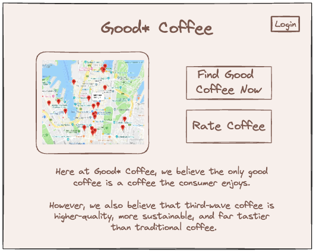
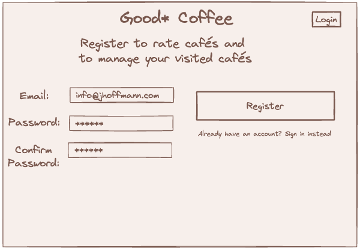
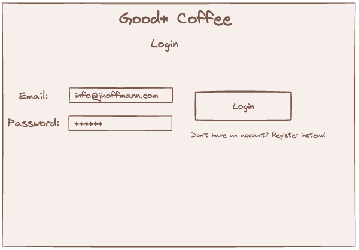
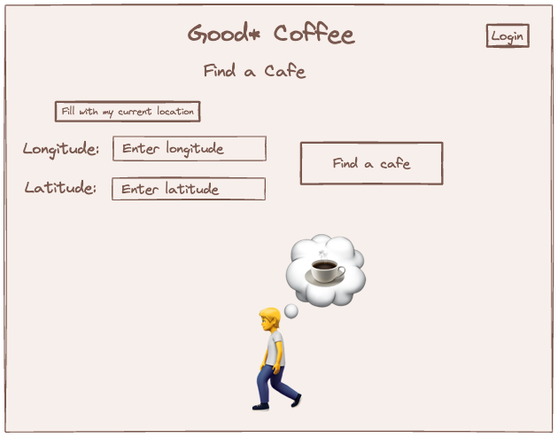
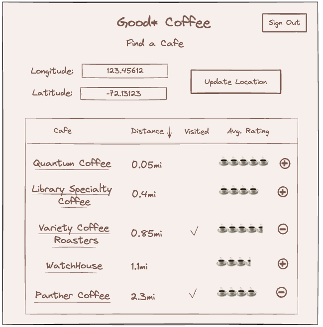
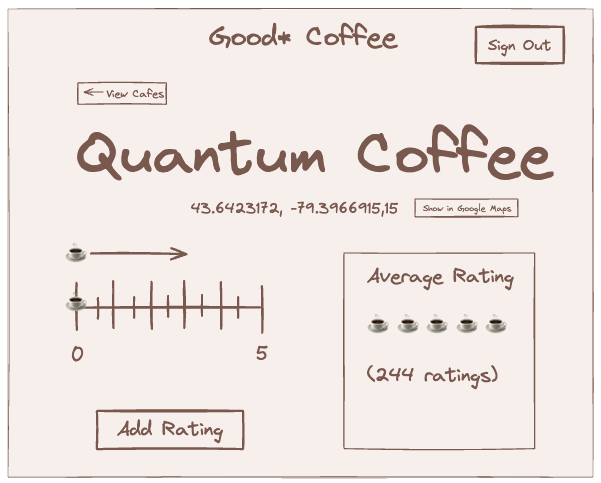
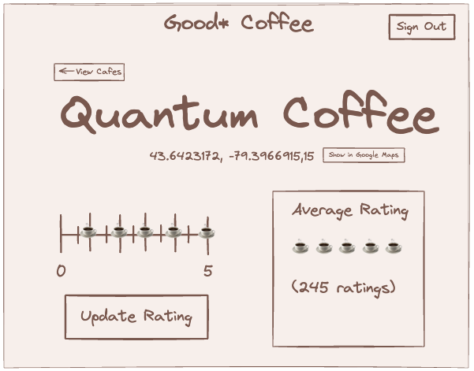
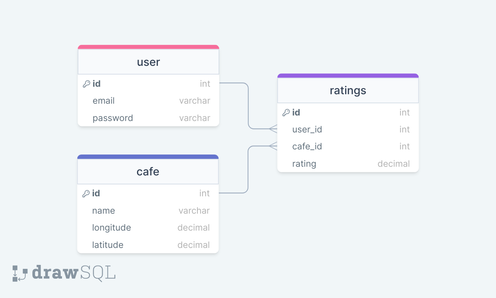

# Project Title
Good* Coffee

## Overview

Good* Coffee is a place for third-wave coffee enthusiasts to find and keep track of the best cafés.

### Problem

Third-wave coffee is coffee made with high-quality beans typically sourced from individual farms and roasted more lightly to bring out their distinctive flavors. There is no certain way to know the quality of a café's coffee before purchasing and having your first sip. When looking for a third-wave café in a given area, people generally have to go through the time-consuming process of doing a Google search for coffee near a location then manually analyze images, reviews, etc. for each café before deciding if it might be a café serving a high-quality cup of third-wave coffee.

### User Profile

- Coffee drinkers:
    - looking for a café close to their current location
    - looking for a café close to a given location for the future
    - that want to keep track of the cafés they've tried

### Features

- As a user, I want to be able to find the closest café close to my current location
- As a user, I want to be able to find the closest café close to any given location
- As a user, I want to be able to find the highest-rated café within a certain distance from any given location

- As a user, I want to be able to create an account to manage my visited cafés
- As a user, I want to be able to login to my account to manage my visited cafés

- As a logged in user, I want to be able to rate a visited café out of 5 coffee cups
- As a logged in user, I want to be able to update a rating of a café out of 5 coffee cups
- As a logged in user, I want to be able to see my visited cafés
- As a logged in user, I want to be able to filter my visited cafés by location

## Implementation

### Tech Stack

- React
- TypeScript
- MySQL
- Express
- Client libraries: 
    - react
    - react-router
    - axios
- Server libraries:
    - knex
    - express
    - bcrypt for password hashing

### APIs

- No external APIs will be used for the first sprint

### Sitemap

- Home page
- List cafés
- View + Rate a café
- Register
- Login

### Mockups

#### Home Page

#### Register Page

#### Login Page

#### Enter Location Page

#### View Cafes Page

#### View Cafe Page

#### View Cafe Page (Rated state)

### Data

### Endpoints

 
<code>GET /cafes</code>

##### Parameters

> | name      |  type     | data type | description                       |
> |-----------|-----------|-----------|-----------------------------------|
> | longitude |  required | number    | User-provided location            |
> | latitude  |  required | number    | User-provided location            |
> | token     |  optional | string    | JWT used to add "visited" boolean |

##### Responses

> | http status code |  response                                                                                              |
> |------------------|--------------------------------------------------------------------------------------------------------|
> | `200`            | `[{ "id": 1, "name": "Quantum Coffee", "distance": 0.25, "averageRating": 4.5, "visited": true}, ...]` |
> | `400`            | `{"code":"400","message":"Bad Request"}`                                                               |
> | `401`            | `{"code":"401","message":"Invalid token"}`                                                             |

    
<code>GET /cafes/:id</code>

##### Parameters

> | name     |  type    | data type | description            |
> |----------|----------|-----------|------------------------|
> | id       | required | number    | Cafe id                |
> | token    | optional | string    | JWT used to add rating |

##### Responses

> | http status code |  response                                                                                       |
> |------------------|-------------------------------------------------------------------------------------------------|
> | `200`            | `{ "id": 1, "name": "Quantum Coffee", "distance": 0.25, "averageRating": 4.5, "userRating": 5}` |
> | `400`            | `{"code":"400","message":"Bad Request"}`                                                        |
> | `401`            | `{"code":"401","message":"Invalid token"}`                                                      |

 
<code>POST /cafes/:id/rating</code>

##### Parameters

> | name     |  type    | data type | description                      |
> |----------|----------|-----------|----------------------------------|
> | id       | required | number    | Cafe id                |
> | token    | required | string    | JWT used to add rating           |
> | rating   | required | number    | Rating out of 5 (0.5 increments) |

##### Responses

> | http status code |  response                                                                                       |
> |------------------|-------------------------------------------------------------------------------------------------|
> | `200`            | `{ "id": 1, "name": "Quantum Coffee", "distance": 0.25, "averageRating": 4.5, "userRating": 5}` |
> | `400`            | `{"code":"400","message":"Rating must be between 0 and 5 at 0.5 increments "}`                  |
> | `401`            | `{"code":"401","message":"Invalid token"}`                                                      |

 
<code>PUT /cafes/:id/rating</code>

##### Parameters

> | name     |  type    | data type | description                      |
> |----------|----------|-----------|----------------------------------|
> | id       | required | number    | Cafe id                |
> | token    | required | string    | JWT used to add rating           |
> | rating   | required | number    | Rating out of 5 (0.5 increments) |

##### Responses

> | http status code |  response                                                                                       |
> |------------------|-------------------------------------------------------------------------------------------------|
> | `200`            | `{ "id": 1, "name": "Quantum Coffee", "distance": 0.25, "averageRating": 4.5, "userRating": 5}` |
> | `400`            | `{"code":"400","message":"Rating must be between 0 and 5 at 0.5 increments "}`                  |
> | `401`            | `{"code":"401","message":"Invalid token"}`                                                      |

 
<code>POST /users/register</code>

##### Parameters

> | name     |  type    | data type | description |
> |----------|----------|-----------|-------------|
> | email    | required | number    |             |
> | password | required | string    |             |

##### Responses

> | http status code |  response                                                                                       |
> |------------------|-------------------------------------------------------------------------------------------------|
> | `200`            | `{ "token": "seyJhbGciOiJIUzI1NiIsInR5cCI6IkpXVCJ9.eyJzdWIiOiIxMjM0NTY3ODkwIiwibmFtZSI6I..." }` |
> | `400`            | `{"code":"400","message":"Unable to create account."}`                                          |

 
<code>POST /users/login</code>

##### Parameters

> | name     |  type    | data type | description |
> |----------|----------|-----------|-------------|
> | email    | required | number    |             |
> | password | required | string    |             |

##### Responses

> | http status code |  response                                                                                       |
> |------------------|-------------------------------------------------------------------------------------------------|
> | `200`            | `{ "token": "seyJhbGciOiJIUzI1NiIsInR5cCI6IkpXVCJ9.eyJzdWIiOiIxMjM0NTY3ODkwIiwibmFtZSI6I..." }` |
> | `400`            | `{"code":"400","message":"Invalid credentials."}`                                               |

### Auth

- JWT auth
    - Before adding auth, all API requests will be using a fake user with id 1
    - Added after core features have first been implemented
    - Store JWT in localStorage, remove when a user logs out
    - Add states for logged in showing different UI in places listed in mockups

## Roadmap

- Create client
    - react project with routes and boilerplate pages

- Create server
    - express project with routing, with placeholder 200 responses

- Create migrations

- Gather 15 sample café geolocations in two different cities

- Create seeds with sample café data

- Deploy client and server projects so all commits will be reflected in production

- Feature: List cafés from a given location
    - Implement list cafés page including location form
    - Store given location in sessionStorage
    - Create GET /cafes endpoint

- Feature: View café
    - Implement view café page
    - Create GET /cafes/:id 

- Feature: Rate café
    - Add form input to view café page
    - Create POST /ratings
    - States for add & update ratings 

- Feature: Home page

- Feature: Create account
    - Implement register page + form
    - Create POST /users/register endpoint

- Feature: Login
    - Implement login page + form
    - Create POST /users/login endpoint

- Feature: Implement JWT tokens
    - Server: Update expected requests / responses on protected endpoints
    - Client: Store JWT in local storage, include JWT on axios calls

- Bug fixes

- DEMO DAY

## Nice-to-haves

- Integrate Google Places / Maps
    - View more details about a café
    - Visual radius functionality
- Forgot password functionality
- Ability to add a café 
- Elite status badging for users and cafés: Gamify user ratings
- Expand rating system
    - Coffee
    - Ambiance
    - Staff
- Expanded user information: full name, favorite café
- Unit and Integration Tests